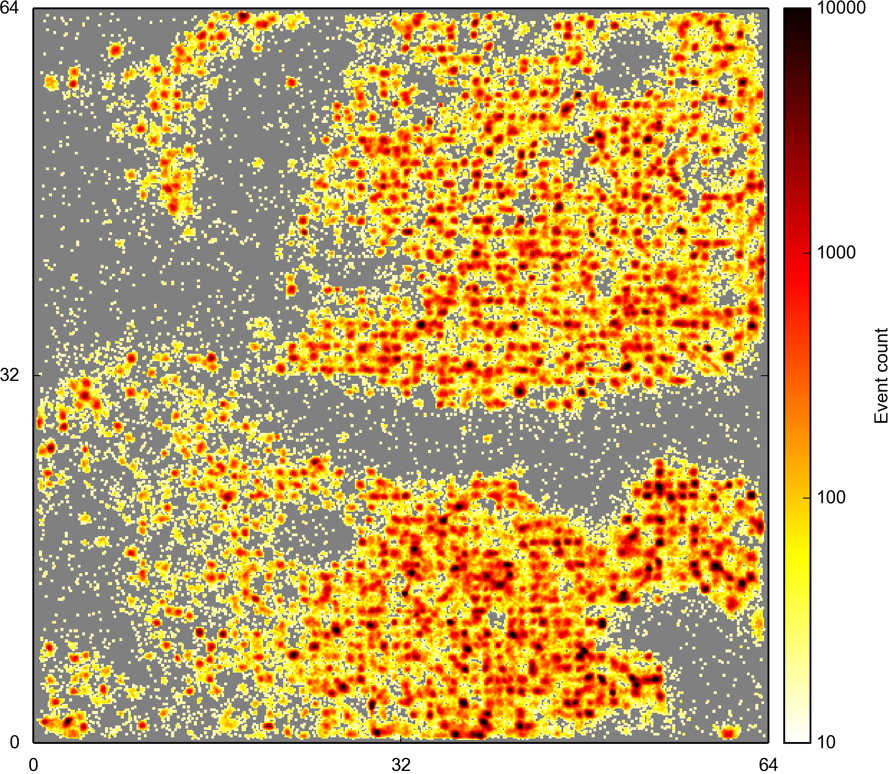
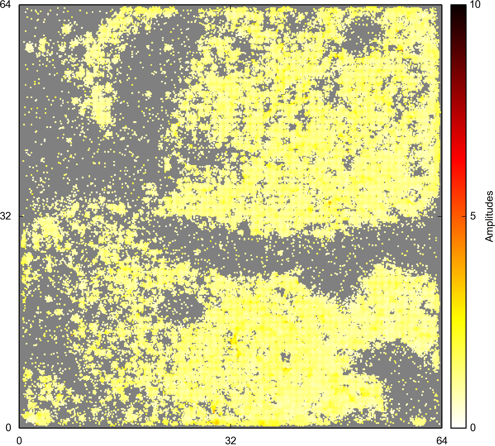

From raw data to sorted spikes
------------------------------

This tutorial explains the steps required to detect and sort a planar, dense multielectrode array recording.

We assume you have a working copy of this repository, and all software ready to use. How to get started is explained in the [setup guide](setup.md).

## 1. Download the data

 The example data was recorded from a mouse retina by Gerrit Hilgen (Newcastle) with a BioCam4096 and BioChip 4096S APS MEA chips. The file has two minutes of raw data acquired with 4,096 channels (pitch 42um), sampled at 7kHz. It can be downloaded from:

[https://datasync.ed.ac.uk/index.php/s/L0UTtQCoKr4fGra](https://datasync.ed.ac.uk/index.php/s/L0UTtQCoKr4fGra)

The password is 'retina'. This file is about 7GB.

## 2. Online spike detection

This step can be skipped if you are only interested in spike sorting.

todo

## 3. Spike detection with interpolation

Go to the directory containing the interpolation detection code, and run:

```
~/herding-spikes/interpolatingDetection> python run_detection.py path-to-example-file/P29_16_05_14_retina02_left_stim3_fullarray_fullfieldHDF5.brw
```

Depending on your CPU, this will complete in about 9 minutes. The directory where the raw data is stored should contain the following files:

```
P29_16_05_14_retina02_left_stim3_fullarray_fullfieldHDF5_INT_Avg.txt
P29_16_05_14_retina02_left_stim3_fullarray_fullfieldHDF5_INT_Info.txt
P29_16_05_14_retina02_left_stim3_fullarray_fullfieldHDF5_INT_Shapes.txt
P29_16_05_14_retina02_left_stim3_fullarray_fullfieldHDF5_INT_ShapesX.txt
P29_16_05_14_retina02_left_stim3_fullarray_fullfieldHDF5_INT_Spikes.txt
P29_16_05_14_retina02_left_stim3_fullarray_fullfieldHDF5_INT_SpikesX.txt
```

The ``Info`` file has all detection parameters, the ``Avg`` file a global average of the array signal (used to compensate for global fluctuations), the ``Spikes`` files all detected spikes, and the ``Shapes`` files the corresponding cut-outs. Files with an ``X`` refer to spikes found with the 4-channel template, and without ``X`` are from the five-channel template. Note that at this point there are still redundant events, which will be removed in the next step.

These are temporary files that can be removed once the next step is complete.

## 4. Spike localisation

In this step, locations are estimated for each detected event, and redundant events are removed:

```
~/herding-spikes/interpolatingDetection> cd ../postProcessing
~/herding-spikes/postProcessing> python run_localisation.py path-to-example-file/P29_16_05_14_retina02_left_stim3_fullarray_fullfieldHDF5.brw
```

For convenience, the script just expects the name of the original ``brw`` file, but it actually processes the ``txt`` files.

Once finished, after about 20 minutes for these data, the file

```
P29_16_05_14_retina02_left_stim3_fullarray_fullfieldHDF5_v28.hdf5
```

contains all detected spikes (614,000 in this example), along with their coordinates (in array coordinates) and averaged waveforms, as well as further information written out during the detection process.

The script also produces a several of images summarising the data:




These two pictures show the event cont (left) and average event amplitudes (right). The shape of the recorded retina, including incisions and the optic disk (left, middle) can be seen.

Note that the two steps up to this point only have to be run once. The default detection parameters are chosen to minimise false negatives, such that reliable detection of units (neurons) with good SNR does not depend much on the precise parameters used here. Unit selection is done in the next step, which is fast and can be run multiple times to choose optimal parameters.

## 5. Spike sorting

Finally, the spikes are clustered into single units with the following command:

```
~/herding-spikes/postProcessing> cd ../clustering
~/herding-spikes/clustering> python run_localisation.py path-to-example-file/P29_16_05_14_retina02_left_stim3_fullarray_fullfieldHDF5_v28.hdf5
```

On a 12 core (6 physical) this completes in roughly one minute, and yields about 1500 units. If the completions time is substantially longer (hours), check if all CPUs/cores are actually utilised. For some configurations, joblib included in scikit-learn seems to cause problems (we are investigating).

The resulting file is called:

```
P29_16_05_14_retina02_left_stim3_fullarray_fullfieldHDF5_v28_clustered_0.3_0.28.hdf5
```

This can be read and inspected with the [Visualisation tool](../visualisationtool).

Todo: computing quality measures to in/exclude units.
